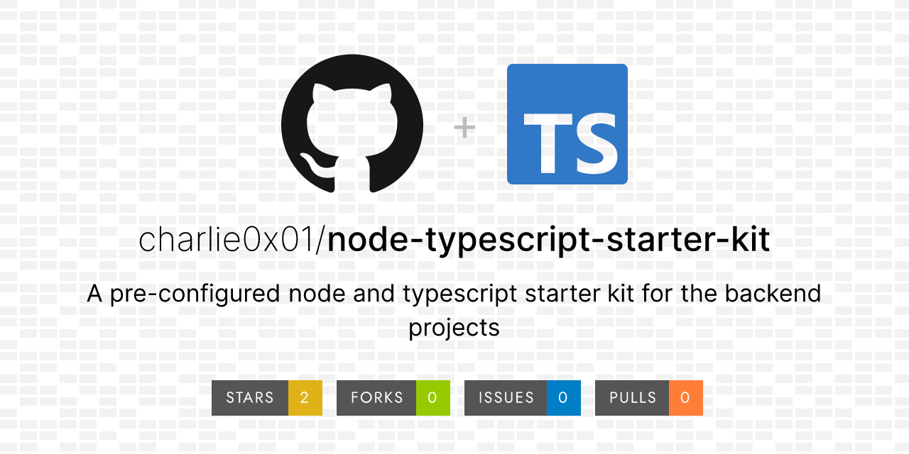

# Node.js and TypeScript Backend Starter Kit

Welcome to the Node.js and TypeScript Backend Starter Kit! This repository provides a robust foundation for building scalable and maintainable backend applications using Node.js and TypeScript. Perfect for developers looking to kickstart new projects without the repetitive setup tasks.

## 🚀 Features

This starter kit comes pre-configured with the following tools:

- [x] **ESLint**: Enforces consistent coding standards with rules configured in `.eslintrc.mjs`.
- [x] **Prettier**: Automatically formats code according to rules specified in `.prettierrc`.
- [x] **Husky**: Ensures code quality by running linting and scripts before commits.
- [x] **Lint-Staged**: Runs linting checks only on staged files during the commit process.
- [x] **Swagger**: Provides interactive API documentation accessible at `/api/v1/default/api-docs`.
- [x] **Jest with SuperTest**: Facilitates comprehensive API testing with Jest and SuperTest integration.
- [x] **Helmet**: Adds security headers to enhance protection against web vulnerabilities.
- [x] **Global Error Handling**: Centralizes error management to handle exceptions consistently across the application.
- [x] **Cluster**: Utilizes multiple Node.js instances to distribute workload and minimize downtime.
- [x] **Winston**: Offers robust logging for errors, warnings, and informational messages across the application.

## ✅ TODOs

- [ ] Set up body parser to limit the request body size
- [ ] Do not return stack trace details to users instead return generic messages to user
- [ ] Set up rete-limiting to fix the number of request a user can make, to prevent ddos attack
- [ ] Set up https, Ensure all data is encrypted by using HTTPS. Obtain and configure SSL/TLS certificates.

## 📦 Getting Started

To get started with this starter kit, follow these simple steps:

**1. Clone the Repository**

```bash
git clone https://github.com/charlie0x01/node-typescript-starter-kit.git
cd node-typescript-starter-kit

# if you want to change the name of repo as you clone, use below command
git clone https://github.com/charlie0x01/node-typescript-starter-kit.git {your-directory-name-here}
cd {your-directory-name}
```

**2. Install Dependencies**

```bash
yarn install # recommended
npm install
```

**3. Set Up Environment Variables**
Copy the .env.example file to .env and configure your environment variables.

**4. Run the Project**
Start the development server with:

```bash
yarn run dev # recommended
npm run dev
```

**5. Build the Project**
To create a production build, use:

```bash
yarn run build # recommended
npm run build
```

**6. Run Tests**
Execute tests using:

```bash
# run test for once
yarn run test # recommended
npm run test

# watch test files and re-run test whenever file changes
yarn run test:watch
npm run test:watch
```

## ⚙️ Test Server by Hitting Welcome API

```bash
http://localhost:8000/api/v1/default/welcome
```

## 📊 Benchmark the Server

```bash
http://localhost:8000/api/v1/default/benchmark
```

## 📚 Documentation

API documentation is available through Swagger UI. Access it by navigating to `http:localhost:8000/api/v1/default/api-docs` in your running application.

## 🤝 Contributing

We welcome contributions to improve this starter kit. Please follow these steps:

Fork the repository.
Create a new branch (git checkout -b 'feature/your-feature'/'your-configuration').
Commit your changes (git commit -am 'Add new feature'/'add new configuration').
Push to the branch (git push origin 'feature/your-feature'/'your-configuration').
Create a new Pull Request.

## 🚨 Issues and Support

If you encounter any issues or have questions, please open an issue on the GitHub repository.

## 📄 License

This project is licensed under the MIT [License](./License). See the LICENSE file for details.

### 🔗 Links

- [NodeJS](https://nodejs.org/en/learn/getting-started/introduction-to-nodejs)
- [TypeScript](https://www.typescriptlang.org/docs/handbook/intro.html) - Using [ts-node](https://www.npmjs.com/package/ts-node) and [typescript](https://www.npmjs.com/package/typescript)
- [ESLint](https://eslint.org/docs/latest/use/getting-started)
- [Prettier](https://prettier.io/docs/en/install.html)
- [Husky](https://typicode.github.io/husky/get-started.html)
- [Lint-Staged](https://www.npmjs.com/package/lint-staged)
- [Swagger](https://swagger.io/docs/specification/basic-structure/) - Using [swagger-autogen](https://swagger-autogen.github.io/docs/getting-started/quick-start/) and [swagger-ui-express](https://www.npmjs.com/package/swagger-ui-express)
- [Express](https://expressjs.com/en/starter/installing.html)
- [Jest](https://jestjs.io/docs/getting-started)

## 🏷️ Tags

Node.js, TypeScript, Backend Starter Kit, Express, ESLint, Prettier, Husky, Lint-Staged, Swagger, Jest, API, Development, Open Source, REST API
